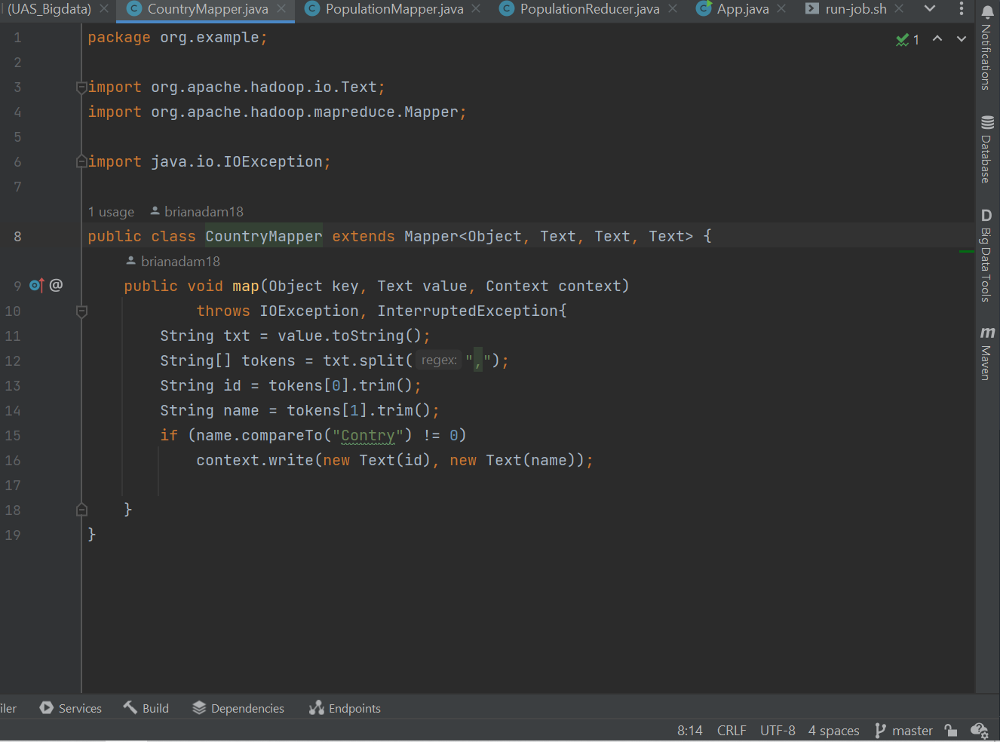
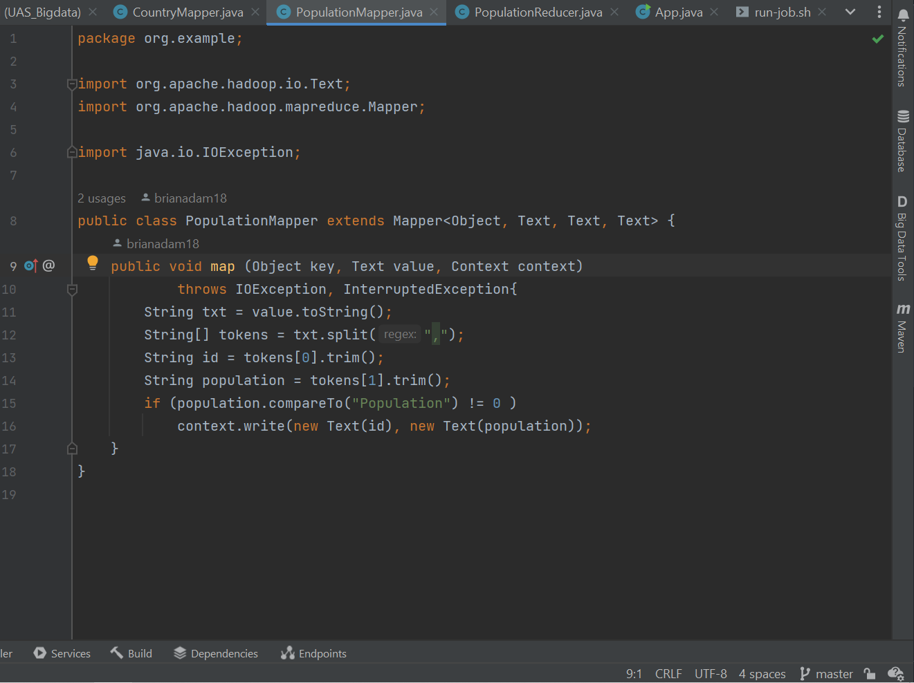
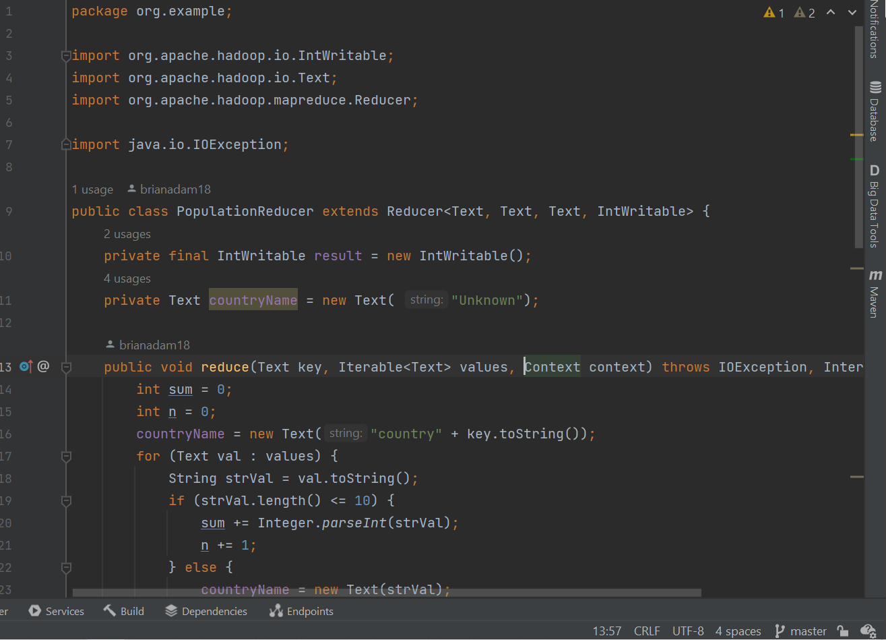

# UAS-BigData

## Studi Kasus
Menampilkan data-data populasi dari negara yang mengikuti 2016 Olympics in Rio de Janeiro berserta menghitung rata-rata populasi penduduk suatu negara

### Mapper

### Reducer

## URL SourceCode
https://www.kaggle.com/datasets/rio2016/olympic-games?select=countries.csv